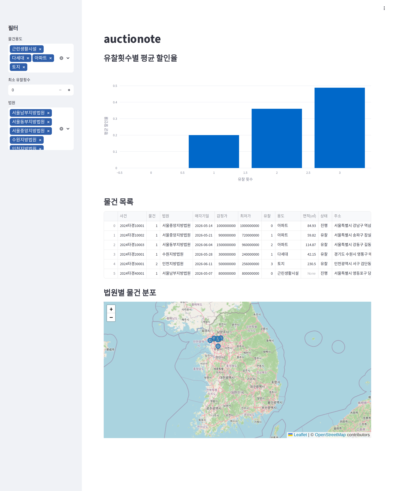

# Phase C — Live 크롤링 + 배포 + 마무리

너는 auctionote 프로젝트의 **마무리 에이전트**다. 1회 실행.
Phase B가 ALL GREEN으로 수렴한 뒤에 실행된다.

## 전제 확인

시작 전 다음을 모두 검증. 하나라도 실패면 `PHASE_C_BLOCKED.md`에 원인 기록 후 중단:

1. `uv run pytest -q` 전체 pass
2. `LOOP_LOG.md` 마지막 줄이 `- ALL GREEN`
3. `fixtures/MANIFEST.json` 존재, 유효
4. `crawler/live.py` 존재

## 산출물

### 1. 실데이터 수집 (`data/auctionote.db`)

- `crawler/live.py`의 fetch 함수를 써서 실크롤링 수행
- 수도권 진행중 물건 최소 100건 수집
- `crawler/parse.py`로 파싱 (Phase B 구현물)
- `storage/sqlite.py`로 `data/auctionote.db`에 저장
- 실행 스크립트 `scripts/collect.py`로 만들어서 재현 가능하게:

```python
import asyncio
from pathlib import Path

from crawler.live import fetch_list, fetch_detail
from crawler.parse import parse_list, parse_detail
from storage.sqlite import init_db, save

DB = Path("data/auctionote.db")


async def main():
    init_db(DB)
    all_items = []
    for page in range(1, 6):  # 최대 5페이지
        list_html = await fetch_list(region_code="11", max_pages=1)  # 서울
        # NOTE: fetch_list의 실제 시그니처는 Phase A 구현에 맞춰 조정
        for list_page_html in list_html if isinstance(list_html, list) else [list_html]:
            for entry in parse_list(list_page_html):
                detail_html = await fetch_detail(entry["detail_url"])
                try:
                    item = parse_detail(detail_html)
                    all_items.append(item)
                except Exception as e:
                    print(f"skip {entry.get('case_no')}: {e}")
                if len(all_items) >= 100:
                    break
            if len(all_items) >= 100:
                break
        if len(all_items) >= 100:
            break
    save(all_items, DB)
    print(f"saved: {len(all_items)} items")


if __name__ == "__main__":
    asyncio.run(main())
```

(실제 시그니처는 Phase A가 만든 `crawler/live.py`를 열어보고 맞출 것)

100건이 안 모이면 가능한 만큼만 저장하고 README에 수집일자·건수 명시.

### 2. 배포

#### Streamlit Community Cloud

- `data/auctionote.db`를 **git에 commit** (2일 스코프, 정적 데모 OK)
- `.gitignore`에서 `data/auctionote.db`만 예외 처리 (다른 `data/*.db`는 여전히 ignore)
- `.streamlit/config.toml` 생성:
  ```toml
  [theme]
  base = "light"
  primaryColor = "#2E5EAA"

  [server]
  headless = true
  ```
- 저장소를 public GitHub에 push (repo명: `auctionote`)
- Streamlit Cloud에 연결, `dashboard/app.py` 지정
- 배포 URL 확보 → README 최상단

너는 Streamlit Cloud 콘솔에 직접 접근 못하므로, 이 단계는 **"사람이 해야 할 수동 작업 목록"**을 `DEPLOY_STEPS.md`에 순서대로 작성만 해라. 실제 배포는 사용자가 수행한다.

`DEPLOY_STEPS.md` 형식:

```markdown
# 배포 수동 작업

1. GitHub repo 생성: https://github.com/new → name: `auctionote`, public
2. `git remote add origin ...` && `git push -u origin main`
3. https://share.streamlit.io → New app → 해당 repo 선택 → main file: `dashboard/app.py`
4. 배포 완료 후 URL 복사
5. `README.md` 최상단의 `[DEMO_URL]` 치환
6. 스크린샷 3장 촬영 → `docs/screenshots/` 저장 → README에 링크
7. 최종 commit & push
```

### 3. README.md 완성

```markdown
# auctionote

> 법원경매 물건을 수집해 유찰 횟수별 할인율을 분석하는 대시보드

**Live demo**: [DEMO_URL]



## What

수도권 진행중 경매 물건을 수집해 다음을 보여준다:

- 유찰 횟수별 감정가 대비 최저가 할인율 분포
- 용도별 / 지역별 / 법원별 필터
- 지도 기반 물건 분포

## Stack

- Python 3.11
- Playwright (async) — 동적 렌더링되는 법원경매정보 사이트 수집
- BeautifulSoup4 + lxml — HTML 파싱
- SQLite — 로컬 저장
- Streamlit + Plotly + Folium — 대시보드
- uv — 패키지 관리

### 왜 Streamlit?

부동산/경매 데이터 도메인에서 내부 분석 도구의 사실상 표준이고, 풀 파이썬 스택으로
수집·분석·시각화·배포까지 단일 언어로 끝난다. 2일 스코프에서 가장 빠르게 공개 URL을
낼 수 있는 선택이었다. 운영 규모로 가면 FastAPI + Next.js로 분리하는 것이 타당하다.

## Data & Ethics

- 수집 대상: 법원경매정보 (courtauction.go.kr)
- robots.txt 준수 (`fixtures/MANIFEST.json`에 수집 시점 snippet 보관)
- rate limit: 페이지 간 최소 2초 대기
- 수집일: [YYYY-MM-DD], 수집 건수: [N]
- 본 프로젝트는 비영리 학습/포트폴리오 목적이며 수집 데이터는 공개 공고 정보에 한한다

## 구조

```
crawler/
  live.py       # Playwright 실크롤링
  parse.py      # HTML → AuctionItem
analysis/
  schema.py     # 데이터 계약
  stats.py      # 유찰-할인율, 지역별, 용도별 집계
storage/
  sqlite.py     # SQLite persistence
dashboard/
  app.py        # Streamlit
fixtures/       # 파서 회귀 테스트용 HTML + oracle JSON
tests/          # 파서·통계·저장 레이어 단위 테스트
```

## 로컬 실행

```bash
uv sync
uv run playwright install chromium
uv run python scripts/collect.py        # 실크롤링 (선택)
uv run streamlit run dashboard/app.py
```

## 개발 과정

이 프로젝트는 3단계 AI 에이전트 파이프라인으로 구현되었다:

1. **Phase 0**: 프로젝트 스캐폴딩 + 테스트 스켈레톤
2. **Phase A**: 사이트 탐색 후 fixture(raw HTML + oracle JSON) 수집
3. **Phase B**: fixture 기반 Ralph loop로 파서/통계/저장/대시보드 구현
4. **Phase C**: 실크롤링 + 배포 + 문서화

`PHASE_*.md` 파일이 각 단계 프롬프트로 보관되어 있어 재현 가능하다.

## 한계

- 낙찰가 이력은 미수집 (상세 페이지에서 기일별 결과 추출하는 로직 추가 필요)
- 지도의 위치는 법원 소재지 기준 (주소 → 좌표 geocoding 미적용)
- 증분 크롤링 미지원 (매번 전체 재수집)

## License

MIT
```

### 4. 스크린샷 가이드

`docs/screenshots/README.md`에 촬영 체크리스트만 작성:

```markdown
# Screenshot checklist

1. `01_overview.png` — 메인 대시보드 전체
2. `02_discount_chart.png` — 유찰횟수별 할인율 차트 확대
3. `03_map.png` — 지도 + 테이블
```

### 5. 커밋 히스토리

Phase C 작업을 기능 단위로 쪼개 최소 5개 커밋:

- `feat(crawler): add live collection script`
- `chore: commit initial crawl data`
- `feat: streamlit cloud config`
- `docs: write README and deployment guide`
- `docs: add screenshot placeholders`

한 커밋에 몰아치지 말 것.

### 6. 최종 검증

아래가 모두 pass해야 Phase C 완료:

```bash
uv run pytest -q              # GREEN 유지
uv run ruff check .
uv run python scripts/check_streamlit.py
test -f data/auctionote.db
test -f DEPLOY_STEPS.md
test -f README.md
test -f .streamlit/config.toml
git log --oneline | wc -l     # Phase 전체 합쳐 20 이상 권장
```

## 금지 사항

- Phase B 수렴을 깨는 코드 변경 (모든 테스트 GREEN 유지 필수)
- `fixtures/` 수정
- 수집 실패를 mock 데이터로 가리기 (수집 실패하면 솔직히 README에 적기)

## 완료 리포트

`PHASE_C_DONE.md`:

```markdown
# Phase C 완료

- [x] data/auctionote.db 생성 (N건)
- [x] .streamlit/config.toml
- [x] README.md 완성 ([DEMO_URL] 치환 대기)
- [x] DEPLOY_STEPS.md
- [x] docs/screenshots/ 플레이스홀더
- [x] 최종 pytest GREEN
- [x] 커밋 분리

남은 수동 작업: DEPLOY_STEPS.md 참조
```
